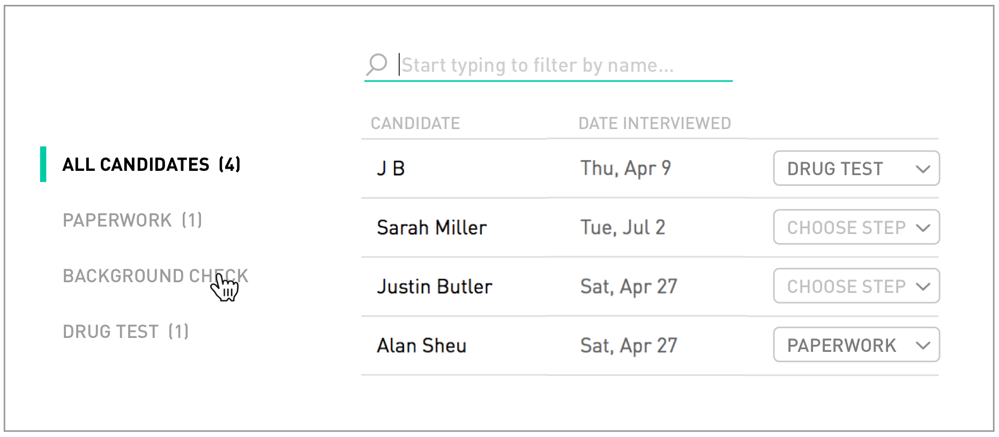

# qa-challenge

Please limit yourself to approx. 2-3 hours

&nbsp;

## Installing App Prerequisites

This app is built using the [BlitzJS framework](https://blitzjs.com/)

- **Step 1:** Install NodeJS (Version 17): [Download Here](https://nodejs.org/en/download/) OR install with [Homebrew](https://brew.sh/) if on MacOS: `brew install node`
- **Step 2:** Install Yarn (the package manager used for this project): Run `npm install --global yarn` (for alternative ways to install yarn, see https://classic.yarnpkg.com/lang/en/docs/install)
- **Step 3:** Install app dependencies: Run `yarn install`
- **Step 4 (VERY IMPORTANT):** Create 2 new files in the root project directory:
  - **File 1:** `.env.local` with the following content: `DATABASE_URL="file:./db.sqlite"`
  - **File 2:** `.env.test.local` with the following content: `DATABASE_URL="file:./db_test.sqlite"`

&nbsp;

## Running The App

---

- **Step 1:** Run `blitz prisma migrate dev` to set up your local sqlite database
- **Step 2:** Run `blitz db seed` to populate the database with candidate data
- **Step 3:** Run `blitz dev` to start the server (if you need to change the default port of 3000, append `-p 4000` or the port number of your choosing)

Open [http://localhost:3000](http://localhost:3000) with your browser to see the app.

&nbsp;

## Submitting

---

Branch off `main` locally, complete the challenge, then send us a zip file containing your automated test script and a document outlining the manual QA results.

`git archive -o qa-challenge.zip HEAD`

&nbsp;

## Automated Script Info

---

**While we recommend using Selenium, Cypress, or Jest, you can use any framework/language you'd like for this.**

### Selenium

- Install Selenium: `yarn add selenium-webdriver`
- Install browser drivers (to open chrome or firefox to run your tests): `yarn add chromedriver` (chrome) or `yarn add geckodriver` (firefox)
- Run your tests using `node selenium/integration/main_spec.js`

&nbsp;

### Cypress Setup

We have pre-installed Cypress for your convenience.

- (Optional) To open the cypress desktop app, run `cypress open`
- You can use the pre-generated `cypress/integration/main_spec.e2e.ts` file to write your cypress tests in. Feel free to create additional spec files to organize your tests.
- Run your tests using `yarn run test:cypress:e2e`

&nbsp;

### Jest

Jest comes preconfigured with this app, so no set up required!

- You can use the pre-generated `jest/example.test.ts` file to write your jest tests in (feel free to create your own spec files as well if you'd like to split your tests up. NOTE: your test files should end in `.test.ts` in order for Jest to automatically pick up the files)
- Run your tests using `yarn run test:jest`

### Other

Please include instructions on how we can set up and run your tests if you use any other testing framework.

&nbsp;

## Task

---

QA a feature that has been developed and marked as ready to deploy to production.
Use both manual and automated QA methods to validate the acceptance criteria has been met.

- Automated QA: please write a script in the language/framework of your choice (selenium, cucumber, etc...)
  to validate the requirements below.
- Manual QA: please list out any discrepencies you see
  between the requirements and the developed feature. Feel free to include annotated screenshots if you'd like.

## Feature

---

### Description

Logged-in hiring managers see a tabbed table called "My Pipeline" that lists job applicants in their various interview steps. The implementation should reflect the design below.

&nbsp;

### Design

&nbsp;

### Acceptance criteria

Verify that all of the items below satisfy the design and functionality described in the feature.

- [ ] Layout & Styling
  - [ ] Layout and spacing is pixel perfect
  - [ ] Colors used match design
- [ ] Data Integrity
  - [ ] All candidates show up in the All Candidates list
  - [ ] Candidate counts by status are correct
  - [ ] Candidates are appropriately displayed in their respective status lists when navigating through the side nav
  - [ ] Interview dates are correct
  - [ ] When changing a candidate's status, they are moved into the appropriate status list and the counts on the side nav are updated (when refreshing the page, the correct updated status should be reflected in the dropdown for each candidate)
- [ ] Search & Filter
  - [ ] Searching for candidates works
  - [ ] Search and filter state carries over between views when navigating from the side nav
